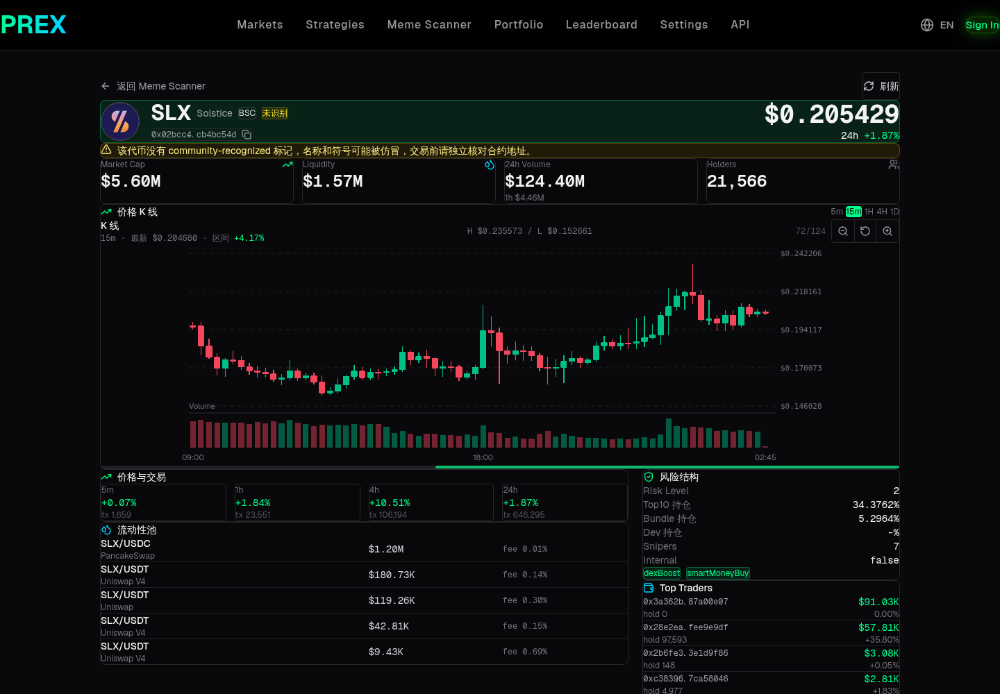

# prex-platform

prex-platform is an AI trading layer for prediction markets and on-chain opportunity discovery.

Live product: [https://prex.best](https://prex.best)

> This repository is a public product showcase. It contains feature descriptions, screenshots, and roadmap notes only. It does not contain PREX source code, private infrastructure, credentials, or trading secrets.

## What PREX Does

PREX helps users discover, analyze, and trade prediction-market opportunities from one interface.

- Aggregates prediction-market data and trading workflows.
- Supports Polymarket-focused market browsing, portfolio views, and trading UX.
- Provides strategy-oriented tools for testing market edges before production use.
- Adds a Meme Scanner for detecting high-momentum small-cap tokens using on-chain and social signals.
- Includes referral and fee-accounting workflows for community growth.
- Tracks product usage through an owner-only analytics board.

## Product Preview

### Home

### Prediction Markets

### Meme Scanner

### Token Detail With K-Line

## Core Modules

| Module | Description |
| --- | --- |
| Markets | Browse active prediction markets, search/filter opportunities, and inspect tradable markets. |
| Trading UX | Connect wallet, manage trading flow, and submit Polymarket orders through PREX. |
| Portfolio | Review user positions and wallet-linked trading state. |
| Strategies | Paper-trading framework for testing market strategies with simulated order, fee, and slippage handling. |
| Meme Scanner | Detect on-chain meme/token opportunities using liquidity, turnover, market cap, social heat, risk concentration, and K-line data. |
| Invite System | User invite links, fee discounts, and reward accounting. |
| Analytics Board | Owner-only traffic, DAU, page view, visitor, and IP-hash statistics. |

## Why It Exists

Prediction markets and on-chain markets are fragmented. Users often need to switch between several sites, wallets, exchange tools, order books, forecasts, and social feeds before making a decision.

PREX is designed to reduce that workflow into one product surface:

- discover the market,
- inspect the data,
- test the edge,
- execute with fewer manual steps,
- review results.

## 中文简介

PREX 是一个面向预测市场和链上机会发现的 AI 交易层。

当前产品重点：

- 聚合预测市场信息和交易流程；
- 优化 Polymarket 交易体验；
- 提供策略模拟和纸面交易记录；
- 增加妖币检测器，用链上数据、社交热度、成交换手、市值结构和风险集中度给小币种打分；
- 支持邀请返佣和用户增长体系；
- 提供站长数据看板，观察 DAU、访问量、页面浏览、IP 统计等。

## Documentation

- [Feature Overview](docs/FEATURES.md)
- [Roadmap](docs/ROADMAP.md)
- [Product FAQ](docs/FAQ.md)

## Contact

Interested in PREX, prediction markets, strategy tooling, or integrations?

- Website: [https://prex.best](https://prex.best)
- X / Telegram / business contact: to be added
