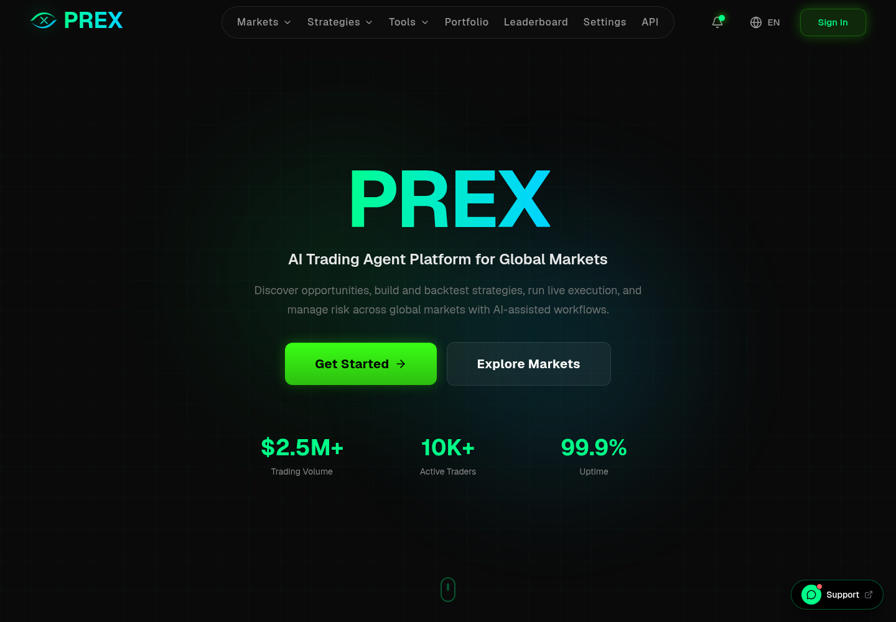
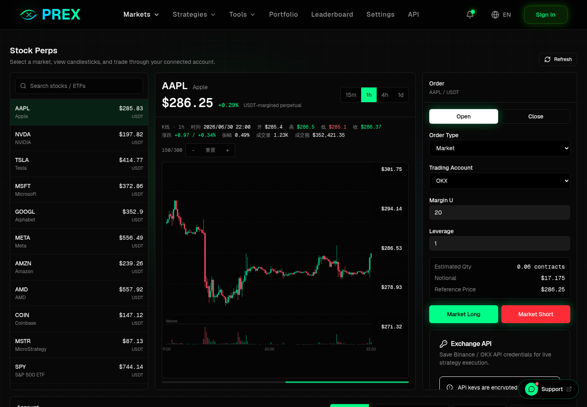
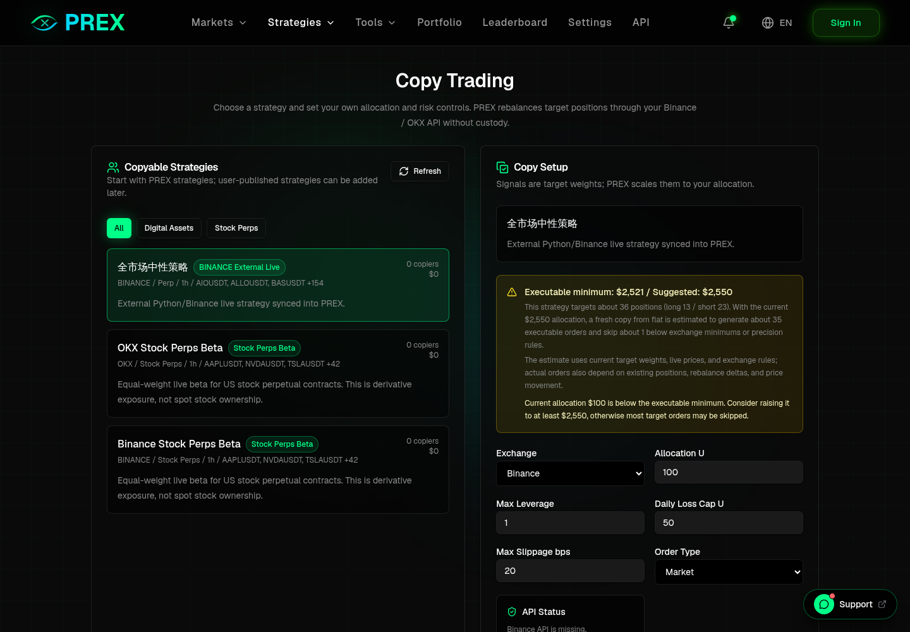
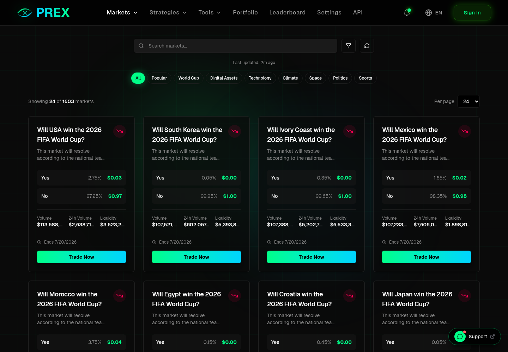
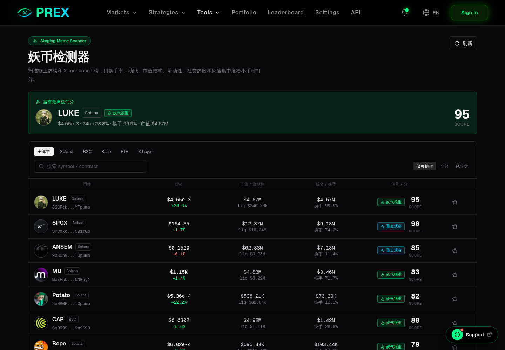

# prex-platform-showcase

PREX is an AI trading agent platform for global markets.

Live product: [https://prex.best](https://prex.best)

> This repository is a public product showcase. It contains feature descriptions, screenshots, and roadmap notes only. It does not contain PREX source code, private infrastructure, credentials, or trading secrets.

## What PREX Does

PREX helps users discover markets, evaluate strategies, run live execution, and manage risk from one interface.

- Provides an AI-assisted trading workflow for global market opportunities across prediction markets, US stock perpetuals, exchange-traded strategies, and on-chain research.
- Aggregates prediction-market data and trading flows.
- Adds a US stock perpetuals workspace with live prices, interactive candlesticks, leverage controls, market and limit orders, position closing, open orders, and trade history.
- Supports natural-language strategy backtesting for exchange-traded strategies.
- Supports Binance / OKX API credential setup for user-controlled live strategy execution.
- Tracks live strategy performance, strategy rankings, and copy-trading setup flows.
- Separates digital-asset strategies and stock-perp strategies in the strategy library.
- Shows connected exchange positions inside the portfolio experience.
- Includes a Meme Scanner for on-chain token discovery and risk screening.
- Includes liquidity and liquidation-pressure tools for futures research.
- Includes referral, product-update, support, analytics, and mobile web workflows.

## Product Preview

### Home

### US Stock Perpetuals

### Strategy Library And Copy Trading

### Prediction Markets

### Meme Scanner

## Core Modules

| Module | Description |
| --- | --- |
| Markets | Browse prediction markets and US stock perpetuals from one market surface. |
| Stock Perps | Trade supported US stock perpetual contracts through connected exchange APIs with leverage, market/limit orders, close flows, open orders, and trade history. |
| Trading UX | Connect wallet or exchange account, manage order flow, and reduce manual switching between tools. |
| Portfolio | Review prediction-market positions and connected exchange positions in one place. |
| Backtesting | Describe a strategy in natural language and run factor-based backtests on exchange data. |
| Live Strategies | Configure Binance / OKX API credentials and run user-controlled live strategy execution from saved backtests, external live strategies, or public candidates. |
| Strategy Library | Compare strategy performance, rankings, capital, drawdown, and copy-trading setup across digital-asset and stock-perp strategies. |
| Copy Trading | Let users follow supported strategies through their own connected exchange accounts, with allocation and risk controls. |
| Meme Scanner | Detect on-chain token opportunities using liquidity, turnover, market cap, social heat, holder concentration, and risk signals. |
| Liquidity Tools | Estimate futures liquidity and liquidation-pressure zones across major venues. |
| Product Updates | Notification bell for recent product changes, releases, and strategy workflow updates. |
| Analytics Board | Owner-only traffic, DAU, feature usage, and trading-volume statistics. |
| Mobile Web | Responsive mobile browsing support for dense trading, strategy, and scanner views. |

## Why It Exists

Most users cannot monitor global markets all day, build executable strategies, evaluate signals transparently, and manage risk across wallets and exchanges at the same time.

PREX is designed to reduce that workflow into one product surface:

- discover the market,
- inspect live data,
- evaluate strategy performance,
- turn ideas into strategy workflows,
- execute or copy trades through connected accounts,
- review positions, orders, and results.

## 中文简介

PREX 是一个面向全球市场的 AI Trading Agent 平台，覆盖预测市场、美股合约、交易所策略和其他高流动性市场。

当前产品重点：

- 聚合预测市场和美股合约交易界面；
- 支持美股合约实时价格、K 线、杠杆、市价/限价、平仓、委托和历史交易；
- 支持自然语言策略回测；
- 支持 Binance / OKX API 配置和用户自控实盘策略执行；
- 支持策略库、排行榜、跟单设置、数字资产 / 美股合约策略分类；
- 支持投资组合中展示预测市场持仓和交易所持仓；
- 提供妖币检测、清算/流动性工具、产品更新、客服、数据看板和移动端适配。

## Documentation

- [Feature Overview](docs/FEATURES.md)
- [Roadmap](docs/ROADMAP.md)
- [Product FAQ](docs/FAQ.md)

## Contact

Interested in PREX, AI trading agents, strategy tooling, or market infrastructure?

- Website: [https://prex.best](https://prex.best)
- X: [https://x.com/No_tariff3](https://x.com/No_tariff3)
- Telegram: [@WARD999999](https://t.me/WARD999999)
- Email: hello@prex.best
