# prex-platform-showcase

PREX is an AI trading agent platform for global markets.

Live product: [https://prex.best](https://prex.best)

> This repository is a public product showcase. It contains feature descriptions, screenshots, and roadmap notes only. It does not contain PREX source code, private infrastructure, credentials, or trading secrets.

## What PREX Does

PREX helps users discover markets, evaluate strategies, run live execution, and manage risk from one interface.

- Provides an AI-assisted trading workflow for global market opportunities across prediction markets, crypto contracts, US stock contracts, exchange-traded strategies, and on-chain research.
- Aggregates prediction-market data and trading flows.
- Adds crypto and US stock contract workspaces with live prices, interactive candlesticks, leverage controls, market and limit orders, position closing, open orders, and trade history.
- Adds A-share and Hong Kong equity intelligence with market breadth, stock-level sentiment, technical indicators, scored conclusions, reference levels, risk alerts, catalysts, filings, and research context.
- Adds PREX AI analysis for supported contract markets, combining trend, structure, momentum, volume, market flow, large orders, funding, news, and benchmark context.
- Guides new users from opportunity discovery to AI analysis, strategy validation, and user-controlled execution through a first-login launcher and a dedicated workflow page.
- Supports a conversation-first Strategy Studio with local chat recovery, engine-compatibility checks, reference cases, natural-language backtesting, and professional equity/drawdown analytics.
- Generates shareable read-only backtest links and branded result posters sized for X, Xiaohongshu, and Douyin, including the trader profile, return, drawdown, and equity curve.
- Adds editable avatars and non-sequential public PREX UIDs, plus platform-aware publishing actions and platform-sized poster downloads.
- Connects users to the PREX Telegram Bot for qualified AI opportunity alerts and follow-up notifications when a setup is invalidated or reverses.
- Supports Binance / OKX / Hyperliquid-oriented account flows where supported by the product surface.
- Tracks live strategy performance, strategy rankings, exchange-account equity snapshots, drawdowns, and copy-trading setup flows.
- Separates digital-asset strategies and stock-contract strategies in the strategy library.
- Shows connected exchange positions inside the portfolio experience.
- Includes a Meme Scanner for on-chain token discovery and risk screening.
- Includes liquidity and liquidation-pressure tools for futures research.
- Includes referral, product-update, support, analytics, and mobile web workflows.

## Product Preview

### Home

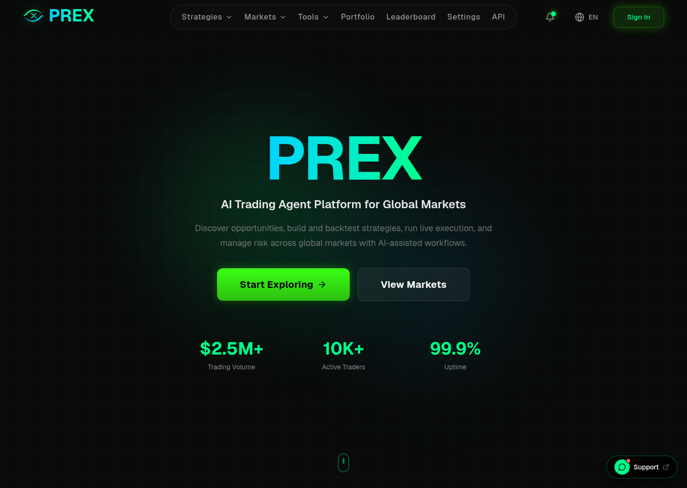

### Guided First-Login Experience

New users can jump directly into PREX AI analysis, natural-language backtesting, or the live strategy marketplace. Analysis and backtesting are highlighted as recommended starting points.

### Discover, Analyze, Validate, And Execute

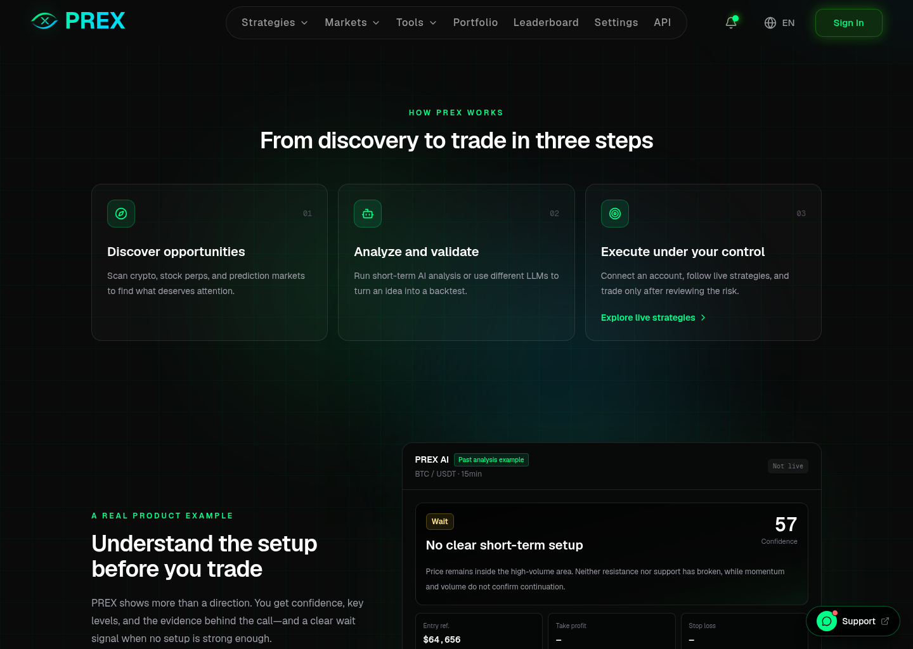

PREX presents the core journey as a clear three-step workflow: discover opportunities, analyze and validate them, then execute only under the user's control.

### Telegram AI Opportunity Alerts

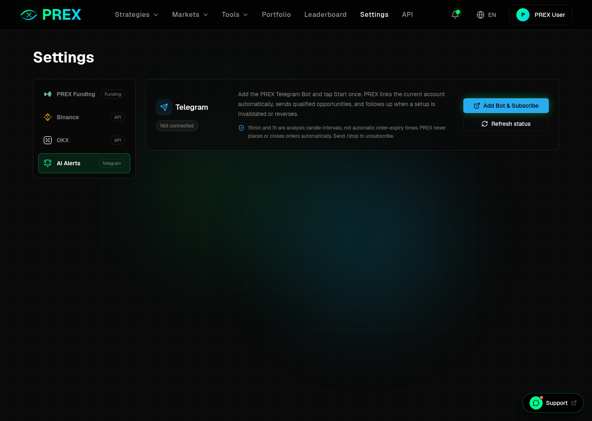

Users can connect `PREXSignalsBot` from Settings. PREX can deliver qualified opportunities and follow-up invalidation or reversal updates; it does not automatically place or close trades.

### US Stock Perpetuals

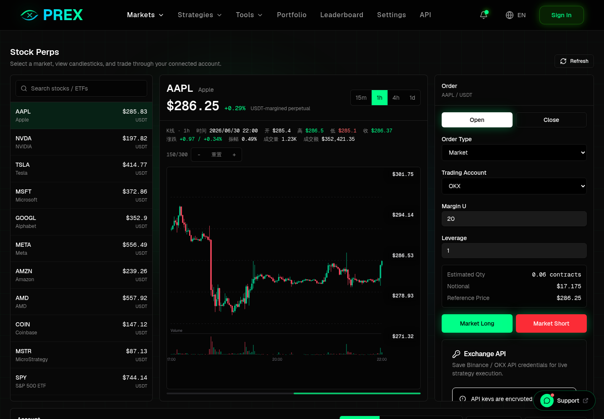

### China And Hong Kong Equity Intelligence

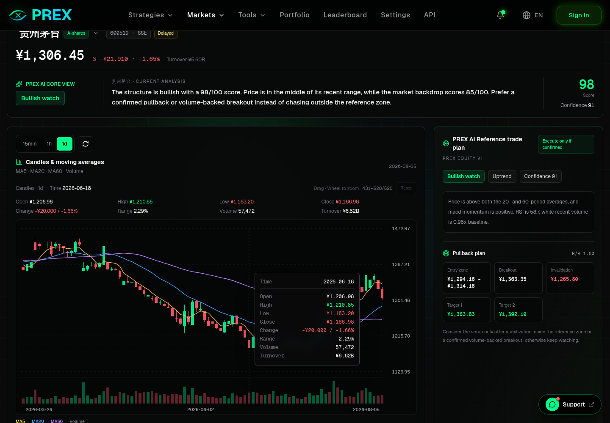

PREX provides a decision-oriented workspace for A-shares and Hong Kong stocks. It brings the core view, score, confidence, trend, reference trade plan, market and stock sentiment, technical indicators, risk alerts, catalysts, filings, and research context into one page. The 15min, 1h, and 1d candlestick views support drag, wheel zoom, crosshairs, and point-level OHLC, change, range, volume, and turnover details.

### Strategy Library And Copy Trading

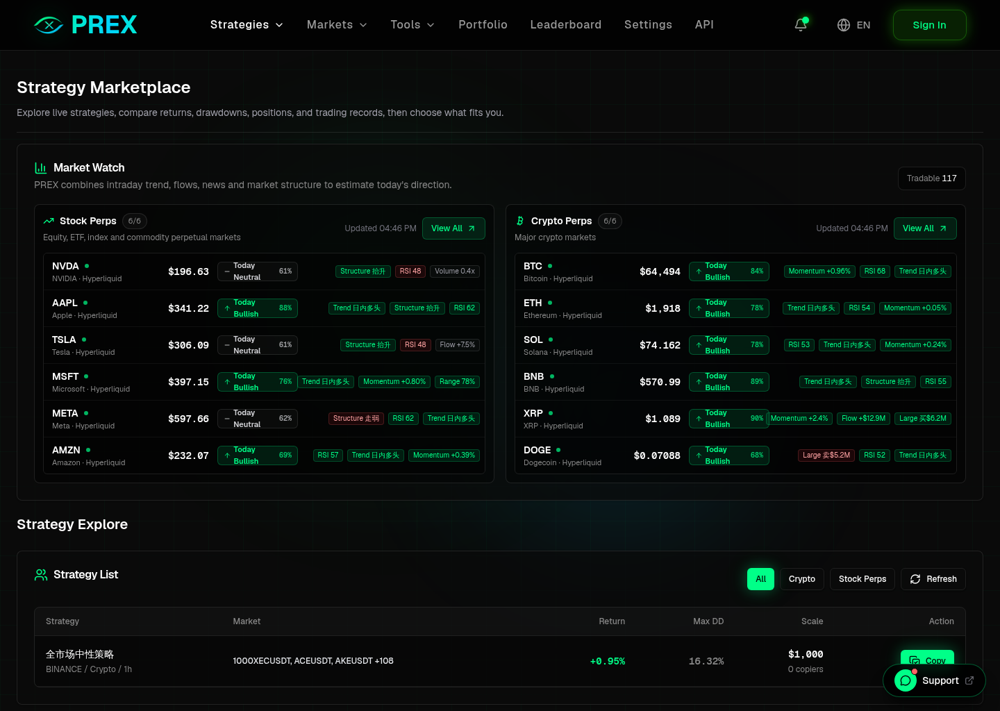

### Multi-LLM Strategy Generation

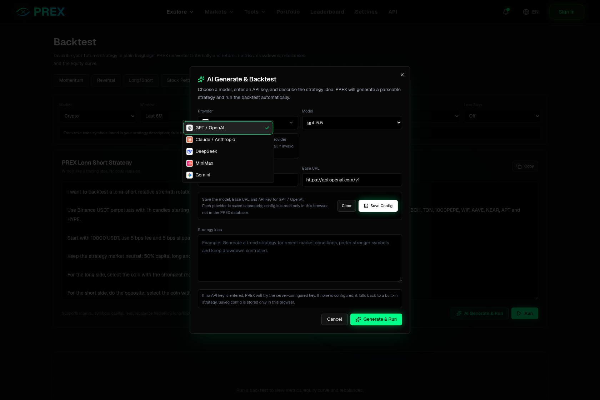

PREX can generate parseable strategies through OpenAI, Anthropic, DeepSeek, MiniMax, or Gemini before running the backtest workflow.

### Conversation-First Strategy Studio

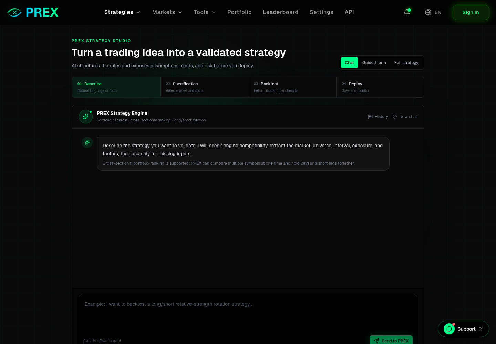

The default workspace starts from a blank conversation. PREX checks whether the portfolio engine supports the idea, extracts the market, universe, interval, exposure, costs, and factors, and asks only for missing inputs. Local chat history and drafts allow users to resume after a failed or interrupted run. Complete reference and popular cases remain available below the conversation without replacing the user's own idea.

### Natural-Language Backtest Results

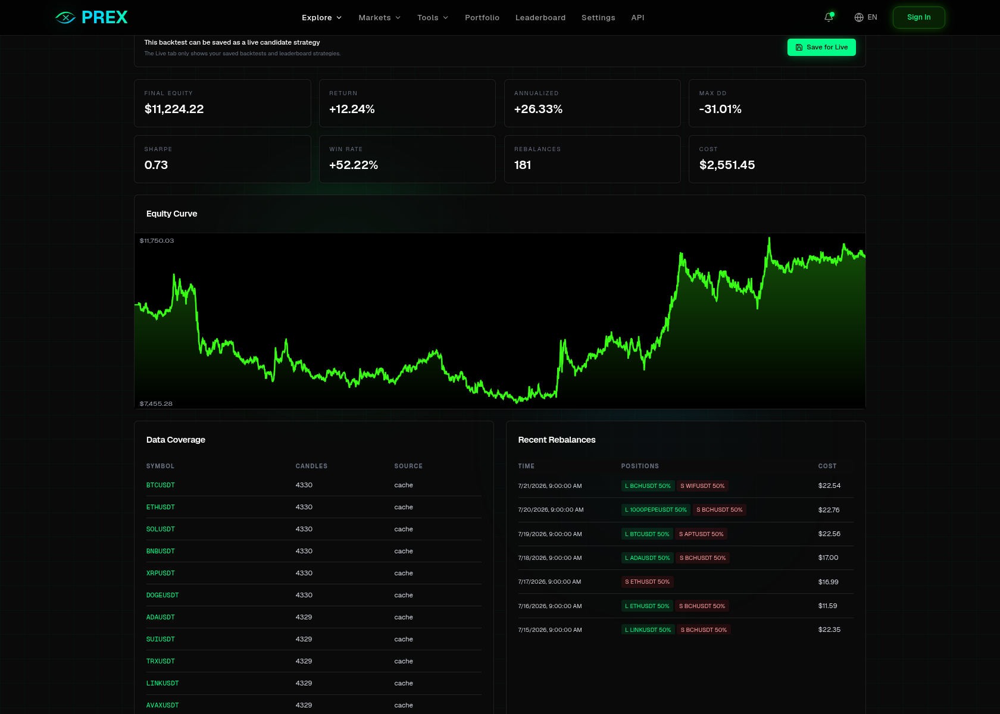

Illustrative historical market-neutral backtest from March 1 to July 21, 2026, including fees, slippage, data coverage, and rebalance records. Past performance does not guarantee future results.

### Professional Equity And Drawdown Analytics

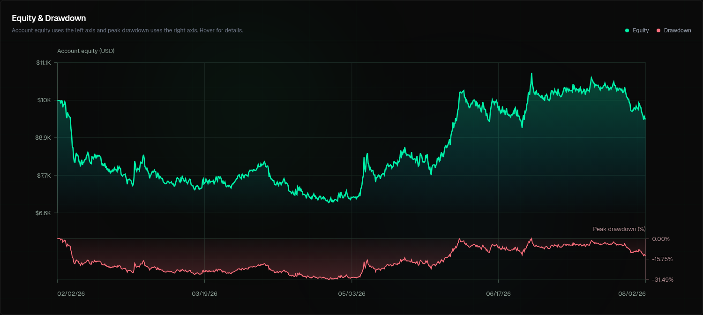

Backtest reports now separate account equity and peak drawdown into synchronized panels. The chart includes a left equity axis, right drawdown axis, time scale, grid lines, and point-level hover details for equity, cumulative return, and drawdown.

### Live Strategy Equity And Drawdown

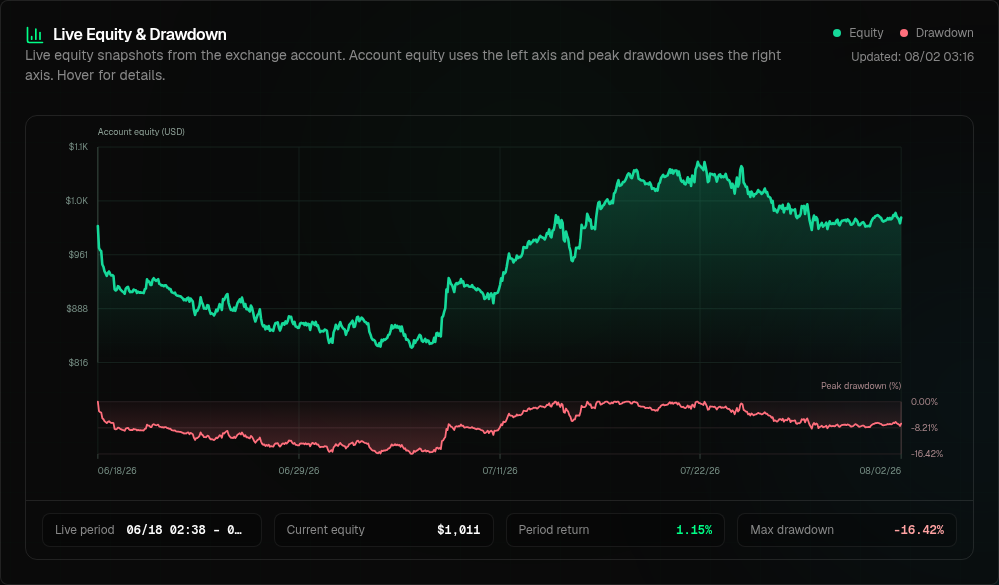

Leaderboard strategy detail pages can display exchange-account equity snapshots together with drawdown history, live period, current equity, period return, and maximum drawdown. The chart remains horizontally accessible on smaller screens.

### Prediction Markets

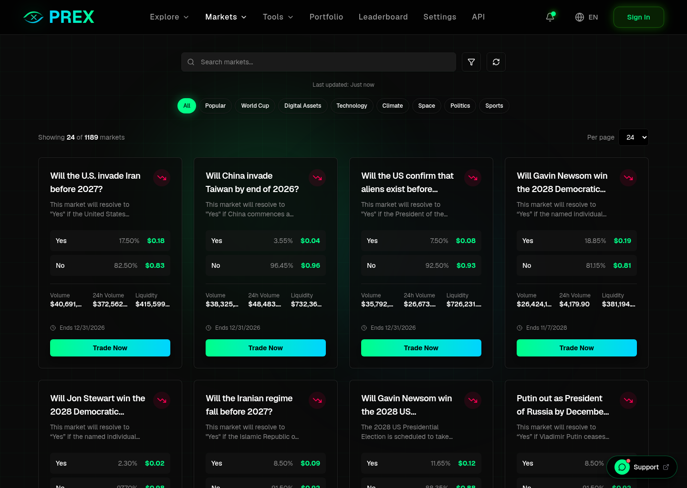

### Meme Scanner

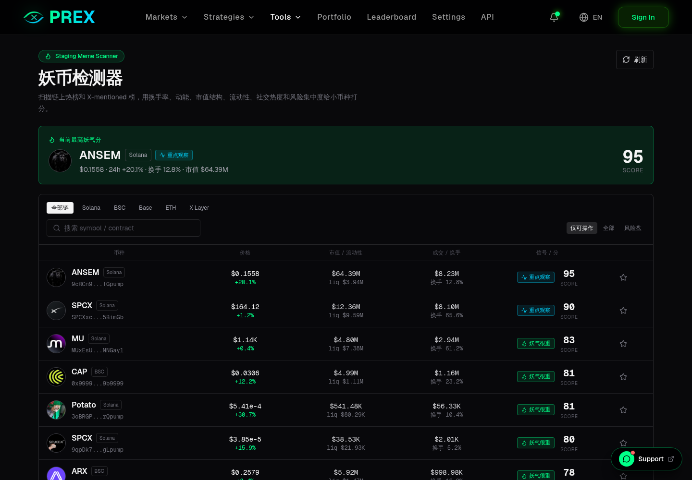

## Core Modules

| Module | Description |
| --- | --- |
| Guided Onboarding | First-login goal selection and a dedicated three-step product workflow for analysis, backtesting, and live strategy discovery. |
| Markets | Browse prediction markets, crypto contracts, and US stock contracts from one market surface. |
| Contract Trading | Trade supported crypto and US stock contracts with leverage, market/limit orders, close flows, open orders, and trade history. |
| PREX AI Analysis | Generate short-term market reads with direction, confidence, structure evidence, key levels, and quick-fill trade parameters. |
| China & Hong Kong Equities | Analyze A-shares and Hong Kong stocks with scored conclusions, sentiment, technicals, reference levels, risk alerts, catalysts, filings, research context, and interactive intraday/daily candlesticks. |
| Telegram AI Alerts | Bind the PREX Telegram Bot to receive qualified opportunity alerts plus invalidation or reversal updates without automatic execution. |
| Trading UX | Connect wallet or exchange account, manage order flow, and reduce manual switching between tools. |
| Portfolio | Review prediction-market positions and connected exchange positions in one place. |
| Backtesting | Build a strategy through a recoverable conversation, review engine compatibility and extracted rules, start from reference cases when useful, run factor-based backtests, and inspect synchronized equity/drawdown analytics. |
| Backtest Sharing | Create a read-only result link or a branded poster for X, Xiaohongshu, and Douyin with the trader avatar, strategy name, return, drawdown, and equity curve. |
| Account Identity | Edit the profile avatar and use a non-sequential public PREX UID on shared strategy results. |
| Live Strategies | Configure Binance / OKX API credentials and run user-controlled live strategy execution from saved backtests, external live strategies, or public candidates. |
| Strategy Library | Compare strategy performance, rankings, capital, exchange-account equity, drawdown history, detail pages, and copy-trading setup across digital-asset and stock-contract strategies. |
| Copy Trading | Let users follow supported strategies through their own connected exchange accounts, with allocation and risk controls. |
| Meme Scanner | Detect on-chain token opportunities using liquidity, turnover, market cap, social heat, holder concentration, and risk signals. |
| Liquidity Tools | Estimate futures liquidity and liquidation-pressure zones across major venues. |
| Product Updates | Notification bell for recent product changes, releases, and strategy workflow updates. |
| Analytics Board | Owner-only traffic, DAU, feature usage, and trading-volume statistics. |
| Mobile Web | Responsive mobile browsing support for dense trading, strategy, and scanner views. |

## Why It Exists

Most users cannot monitor global markets all day, build executable strategies, evaluate signals transparently, and manage risk across wallets and exchanges at the same time.

PREX is designed to reduce that workflow into one product surface:

- discover the market,
- inspect live data,
- evaluate strategy performance,
- turn ideas into strategy workflows,
- execute or copy trades through connected accounts,
- review positions, orders, and results.

## 中文简介

PREX 是一个面向全球市场的 AI Trading Agent 平台，覆盖预测市场、美股合约、交易所策略和其他高流动性市场。

当前产品重点：

- 聚合预测市场、加密货币合约和美股合约交易界面；
- 支持合约实时价格、K 线、杠杆、市价/限价、平仓、委托、历史交易和止盈止损；
- 支持 PREX AI 对合约市场进行短线方向、结构、资金流、大单、新闻和关键价位分析；
- 支持 A股与港股决策分析，集中展示核心结论、评分、趋势、置信度、参考买卖点、市场与个股情绪、技术指标、风险警报、催化因素、公告和研报；
- A股与港股 K 线支持 15min、1h、1d 周期、拖动、滚轮缩放、十字线以及开高低收、涨跌、振幅、成交量和成交额悬停明细；
- 提供首次登录小窗口与三步产品引导，帮助用户直接进入 AI 分析、自然语言回测或实盘策略广场；
- 支持绑定 PREX Telegram Bot，推送满足统一标准的机会，并在机会失效或方向反转时发送更新；不会自动下单或平仓；
- 支持从空白对话开始构建策略、本地恢复历史会话与草稿、检查组合引擎能力、补问缺失参数，并提供完整参考与热门案例；
- 支持自然语言策略回测、AI 辅助策略生成，以及带左右坐标轴、时间轴和悬停明细的净值 / 回撤专业图表；
- 支持生成只读回测链接，以及适配 X、小红书、抖音的战绩海报，展示用户头像、策略名称、收益、最大回撤和资金曲线；
- 支持 Binance / OKX / Hyperliquid 相关账户和交易流程；
- 支持策略库、排行榜、实盘净值与回撤详情、跟单设置、数字资产 / 美股策略分类；
- 支持投资组合中展示预测市场持仓和交易所持仓；
- 提供妖币检测、清算/流动性工具、产品更新、客服、数据看板和移动端适配。

## Documentation

- [Feature Overview](docs/FEATURES.md)
- [Product Updates](docs/CHANGELOG.md)
- [Roadmap](docs/ROADMAP.md)
- [Product FAQ](docs/FAQ.md)

## Contact

Interested in PREX, AI trading agents, strategy tooling, or market infrastructure?

- Website: [https://prex.best](https://prex.best)
- X: [https://x.com/No_tariff3](https://x.com/No_tariff3)
- Telegram: [@WARD999999](https://t.me/WARD999999)
- Email: hello@prex.best
