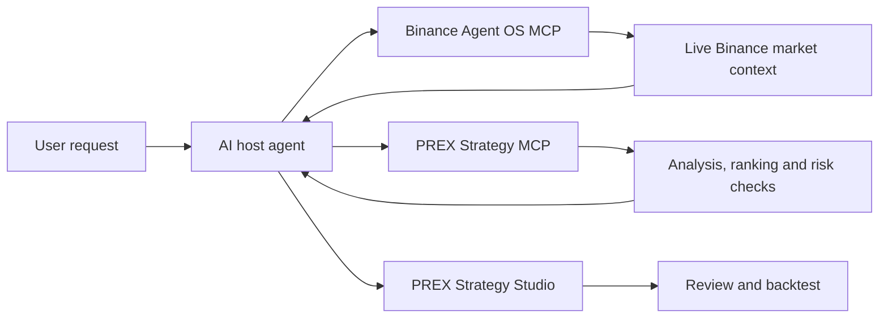

<p align="center">
  
</p>

# PREX AI Strategy Agent × Binance Agent OS

> Binance Agent OS Mini Hackathon — Track A: Agent Creation

PREX AI Strategy Agent turns live market context into understandable, testable trading strategies. It combines Binance Agent OS for current market data with PREX Strategy MCP for analysis, cross-market ranking, risk checks, and strategy-draft handoff to PREX Strategy Studio.

The default competition workflow is read-only. It does not place orders, request withdrawal permission, or replace PREX's existing user-authorized execution system.

[Live product](https://prex.best) · [PREX Strategy MCP](https://prex.best/api/mcp) · [Submission repository](https://github.com/wcq-glhf/prex-platform-showcase/tree/main/hackathons/binance-agent-os) · [中文说明](README.zh-CN.md)

## Why this agent

Most everyday traders can describe an idea, but cannot continuously collect market context, translate it into precise rules, and verify it before risking capital. PREX AI Strategy Agent closes that gap:

1. Read current price, candles, funding, and order-book context through Binance Agent OS.
2. Analyze trend, momentum, volatility, volume, and market structure with PREX.
3. Compare multiple assets at the same timestamp for cross-sectional research.
4. Convert the conclusion into a complete strategy draft.
5. Open the draft in PREX Strategy Studio for review and backtesting.

## Architecture



The two MCP servers have separate responsibilities:

| Service | Responsibility | Default permission |
|---|---|---|
| Binance Agent OS MCP | Live market data and Binance-side context | Market data only |
| PREX Strategy MCP | Analysis, ranking, public strategy discovery, and trade-plan validation | Read-only |
| PREX Strategy Studio | Review, backtest, save, and publish a strategy | User initiated |

## PREX MCP tools

| Tool | What it does |
|---|---|
| `prex_get_market_context` | Analyzes one asset using momentum, RSI, EMA, ATR, volume, and range position. |
| `prex_rank_market_momentum` | Ranks 2–20 assets by trailing return at the same timestamp. |
| `prex_list_public_strategies` | Returns privacy-safe public strategy summaries and performance. |
| `prex_prepare_binance_trade_plan` | Validates direction, TP/SL, notional, leverage, margin, maximum loss, and risk/reward. It never submits an order. |

Single-asset analysis and cross-market ranking can return a `strategyStudio.url`. The URL opens a prefilled strategy idea for user review; it never starts a backtest or trade automatically.

## Connect the agent

Use an MCP-compatible host supported by Binance, such as Codex, Claude, ChatGPT, Cursor, or VS Code.

Add both Streamable HTTP endpoints:

```text
Binance Agent OS: https://agent.binance.com/mcp/agentic
PREX Strategy MCP: https://prex.best/api/mcp
```

A Codex configuration example is available at [`config/codex.example.toml`](config/codex.example.toml). The host handles Binance authentication; do not place access tokens in this repository or in screen recordings.

## Reproduce the public PREX MCP check

Requirements: Node.js 20 or newer. No API key is required for the public, rate-limited PREX research endpoint.

```bash
npm run verify
npm run demo:eth
```

`npm run verify` checks MCP initialization and tool discovery. `npm run demo:eth` calls the read-only single-asset analysis tool and prints a compact result.

## Suggested demo

1. Show that `binance-agent-os` and `prex-strategy` are connected in the host agent.
2. Ask Binance Agent OS for ETHUSDT price, 1-hour candles, funding, and order-book context.
3. Ask PREX to analyze ETH trend, momentum, volatility, and key risks.
4. Ask PREX to rank BTC, ETH, SOL, BNB, and XRP over the same 24-hour lookback.
5. Open the returned Strategy Studio link, review the prefilled rules, and run a backtest.
6. Show the resulting return, drawdown, trade count, and equity curve.

The detailed recording script is in [`docs/DEMO_SCRIPT.md`](docs/DEMO_SCRIPT.md).

## Safety design

- PREX MCP exposes no order-placement, transfer, or withdrawal tool.
- The demo requests Binance Market Data permission only.
- Symbols, venues, intervals, numeric inputs, request sizes, and request rates are bounded.
- The trade-plan tool is analysis, not authorization.
- Any optional Binance write action must be separately requested and confirmed in Binance's official flow.
- PREX's existing API-based strategy automation is a separate product path and is not represented as Agent OS activity.
- Public strategy endpoints do not reveal private factor code, weights, parameters, credentials, or account data.

See [`docs/SAFETY.md`](docs/SAFETY.md) for the trust boundaries and failure behavior.

## Repository map

```text
config/                 Example dual-MCP host configuration
docs/                   Architecture, demo, safety, and submission notes
examples/               Agent instructions and demo prompts
scripts/                Dependency-free MCP verification scripts
assets/                 PREX brand asset
```

## Competition submission

- Track: **Track A — Agent Creation**
- Product: **PREX AI Strategy Agent**
- Website: [https://prex.best](https://prex.best)
- Public MCP: [https://prex.best/api/mcp](https://prex.best/api/mcp)
- Demo video: added in the final X submission

The official competition announcement describes Track A as building an AI agent with Agent OS and asks entrants to submit a video/demo plus GitHub where applicable. See the [official Binance announcement](https://www.binance.com/en/square/post/362885563835358) and [Binance Agentic MCP documentation](https://developers.binance.com/en/docs/agent-native/mcp-server/agentic).

## Disclaimer

This project is for research and demonstration. It does not provide financial advice. Market analysis and backtests can be wrong and do not guarantee future performance. Users remain responsible for permissions, risk limits, and every trading decision.
