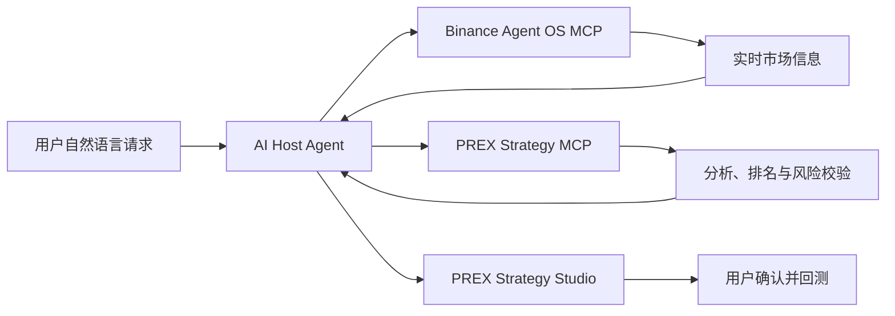

# PREX AI Strategy Agent × Binance Agent OS

> Binance Agent OS Mini Hackathon — Track A：Agent Creation

PREX AI Strategy Agent 将 Binance Agent OS 提供的实时市场信息，转化为普通用户能够理解、验证和回测的策略规则。

比赛演示默认全程只读：不自动下单、不申请提现权限，也不替代 PREX 原有的用户授权实盘系统。

[PREX 官网](https://prex.best) · [完整比赛演示视频](assets/prex-binance-agent-os-demo.mp4) · [PREX Strategy MCP](https://prex.best/api/mcp) · [English](README.md)

## 核心流程

1. Binance Agent OS MCP 获取实时价格、K 线、资金费率和订单簿信息。
2. PREX Strategy MCP 分析趋势、动量、波动率、成交量和市场结构。
3. 用户可以继续进行多标的横截面强弱排名。
4. Agent 把结论整理为完整、可检查的策略草案。
5. 用户打开 PREX Strategy Studio，确认规则并主动运行回测。



## 四个 PREX 工具

- `prex_get_market_context`：单标的趋势、动量、RSI、EMA、ATR、成交量和区间位置分析。
- `prex_rank_market_momentum`：在同一时间点对 2–20 个标的进行横截面强弱排名。
- `prex_list_public_strategies`：读取经过隐私保护的公开策略和表现摘要。
- `prex_prepare_binance_trade_plan`：校验方向、止盈止损、名义价值、杠杆、预计保证金、最大亏损和盈亏比；不会提交订单。

## 安全边界

- PREX MCP 没有下单、转账或提现工具。
- 演示仅申请 Binance Market Data 权限。
- 交易计划只是分析结果，不代表授权。
- 如果用户未来主动使用 Binance 官方交易工具，仍需在 Binance 的正式流程中单独确认。
- PREX 原有 API 自动实盘是独立产品能力，不会冒充 Agent OS 交易。
- 公开策略不会泄露私有因子、参数、权重、凭据或账户数据。

## 本地验证

需要 Node.js 20 或以上版本：

```bash
npm run verify
npm run demo:eth
```

详细演示步骤见 [`docs/DEMO_SCRIPT.md`](docs/DEMO_SCRIPT.md)。

## 参赛信息

- 赛道：Track A — Agent Creation
- 项目：PREX AI Strategy Agent
- 官网：https://prex.best
- PREX MCP：https://prex.best/api/mcp
- 视频：完成后放入最终 X 投稿

本项目仅用于研究与演示，不构成投资建议。回测与分析不保证未来表现，交易权限和风险始终由用户控制。
