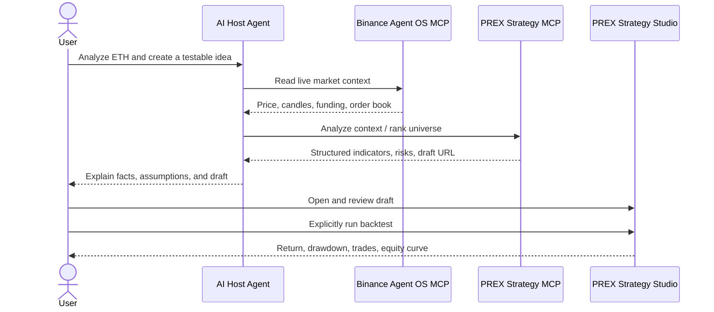

# Architecture and trust boundaries

## Components

### AI host agent

The host agent interprets the user's request and orchestrates two independent MCP servers. It does not receive hard-coded credentials from this repository.

### Binance Agent OS MCP

Binance owns the venue connection, authentication, permission screen, live data, and any optional execution confirmation. The competition demo uses Market Data permission only.

### PREX Strategy MCP

PREX exposes a stateless Streamable HTTP MCP endpoint. It provides four bounded, read-only research tools. Requests are size-limited, allowlisted, and rate-limited.

### PREX Strategy Studio

Strategy Studio is the user-facing verification layer. A user can inspect the generated specification, run a historical backtest, review costs and risk, save the result, or publish it. Opening a draft URL does not run or deploy anything.

## Data flow

## Why two MCPs

The split keeps venue authority and strategy intelligence separate. Binance remains authoritative for Binance market/account data. PREX remains responsible for transforming research context into transparent strategy specifications and validation workflows.

The architecture also prevents PREX's public research endpoint from holding Binance user tokens or silently executing trades.

